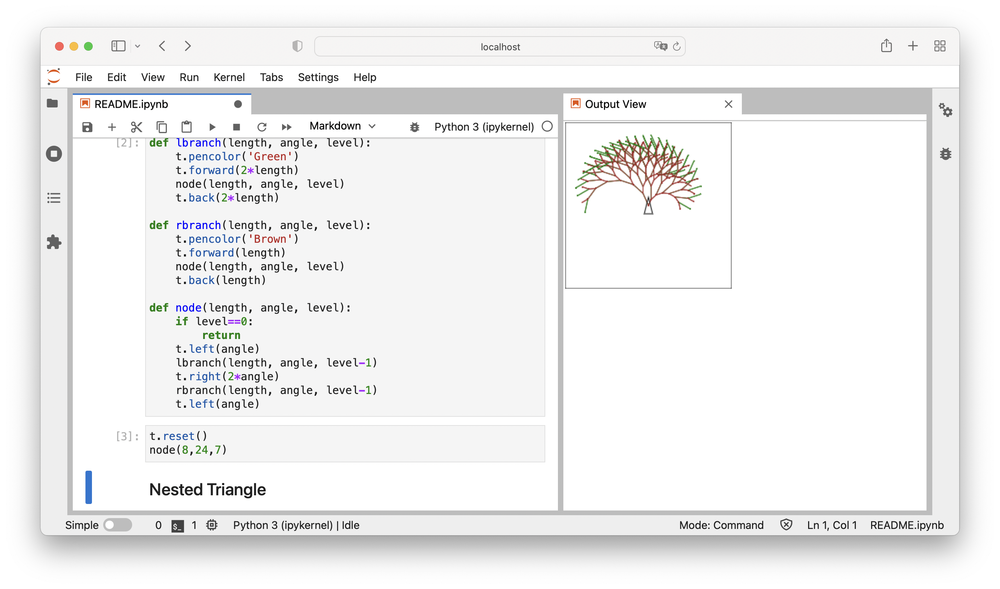

ipython-turtle-next
===================

Creating Turtle Graphics in IPython/Jupyter with ipycanvas
----------------------------------------------------------

This is inspired by https://github.com/gkvoelkl/ipython-turtle-widget.
Thanks.

I am using **ipycanvas** (https://github.com/martinRenou/ipycanvas).
Thanks to Martin Renou.



If you like it, use it. If you have some suggestions, tell me
(hebi@python-ninja.com).

Install
-------

To install use pip:
~~~~~~~~~~~~~~~~~~~

```
$ pip install ipyturtlenext
```

Examples
--------

The most examples are inspired by **Harold Abelson, Andrea diSessa:
Turtle Geometry, MIT Press 1986**

**ipyturtlenext** should work in every jupyter environment, where
ipycanvas works.

Start
~~~~~

.. code:: ipython3

    from ipyturtlenext import Turtle
    
    t = Turtle(width=200, height=200)
    t

With *width* and *height* you can change the extension of the drawing
canvas.

In Jupyterlab you can create with *new view for outout* a separeted tab.

First Steps
~~~~~~~~~~~

.. code:: ipython3

    t.right(90)
    t.heading()

.. code:: ipython3

    t.forward(150)
    t.left(45)

.. code:: ipython3

    t.back(100)

.. code:: ipython3

    t.left(45)
    t.penup()
    t.forward(100)

Square
~~~~~~

.. code:: ipython3

    t.reset() #clear canvas and start again

.. code:: ipython3

    t.back(40)
    t.forward(100)
    t.position()

.. code:: ipython3

    def square(size):
        for i in range(4):
            t.forward(size)
            t.right(90)

.. code:: ipython3

    square(20)

Triangel
~~~~~~~~

.. code:: ipython3

    t.reset()

.. code:: ipython3

    def triangle(size):
        for i in range(3):
            t.forward(size)
            t.right(120)

.. code:: ipython3

    triangle(100)

House
~~~~~

.. code:: ipython3

    t.reset()

.. code:: ipython3

    def house(size):
        square(size)
        t.forward(size)
        t.right(30)
        triangle(size)

.. code:: ipython3

    t.back(100)
    house(100)

Circle
~~~~~~

.. code:: ipython3

    t.reset()
    
    def circle():
        for i in range(360):
            t.forward(1)
            t.right(1)

.. code:: ipython3

    circle()

Poly
~~~~

.. code:: ipython3

    t.reset()

.. code:: ipython3

    def poly(side, angle):
        turn = 0
        while turn == 0 or turn % 360 != 0:
            t.forward(side)
            t.right(angle)
            turn += angle

.. code:: ipython3

    poly(44,135)

Color
~~~~~

Return the current pen color as RGB tuple or web color name

.. code:: ipython3

    t.reset()
    t.pencolor()

Set pen color as web color name

.. code:: ipython3

    t.pencolor('Green')

Set pen color with RGB value

.. code:: ipython3

    t.pencolor(255,0,0)

.. code:: ipython3

    t.forward(40)
    t.right(120)
    t.pencolor('Blue')
    t.forward(40)

.. code:: ipython3

    t.pencolor('Red')
    t.pendown()

.. code:: ipython3

    t.forward(100)

Branch
~~~~~~

.. code:: ipython3

    def lbranch(length, angle, level):
        t.pencolor('Green')
        t.forward(2*length)
        node(length, angle, level)
        t.back(2*length)
        
    def rbranch(length, angle, level):
        t.pencolor('Brown')
        t.forward(length)
        node(length, angle, level)
        t.back(length)
    
    def node(length, angle, level):
        if level==0:
            return
        t.left(angle)
        lbranch(length, angle, level-1)
        t.right(2*angle)
        rbranch(length, angle, level-1)
        t.left(angle)

.. code:: ipython3

    t.reset()
    node(8,24,7)

Nested Triangle
~~~~~~~~~~~~~~~

.. code:: ipython3

    def nested_triangle(size):
        if size < 10:
            return
        for i in range(3):
            nested_triangle(size/2)
            t.forward(size)
            t.right(120)

.. code:: ipython3

    t.reset()
    nested_triangle(100)

Snowflake
~~~~~~~~~

.. code:: ipython3

    def snowflake(size, level):
        for i in range(3):
            side(size, level)
            t.right(120)
    
    def side(size, level):
        if level == 0:
            t.forward(size)
            return
        side(size/3, level - 1)
        t.left(60)
        side(size/3, level - 1)
        t.right(120)
        side(size/3, level - 1)
        t.left(60)
        side(size/3, level - 1)

.. code:: ipython3

    t.reset()
    snowflake(100,4)

Nested squares
~~~~~~~~~~~~~~

.. code:: ipython3

    t.reset()
    sideLength = 40
    for square in range(5):
        for side in range(4):
            t.forward(sideLength)
            t.left(90)
        sideLength += 10

Changelog
---------

0.1.0 First published version

